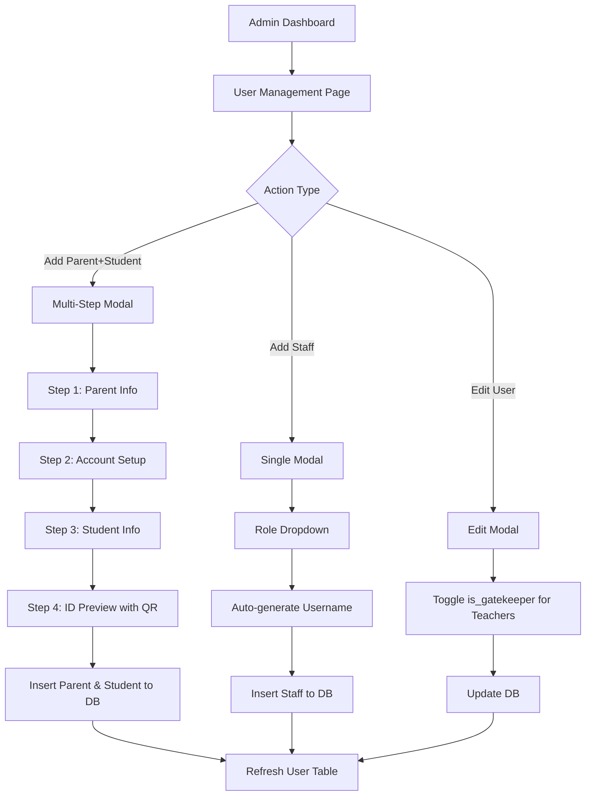
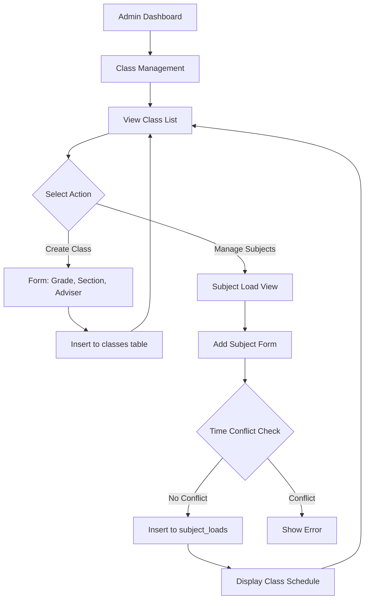

# Admin Module Implementation Plan - Educare School Management System

## Overview
This plan outlines the implementation of the Admin Module with 4 main features:
1. **User Management** - CRUD for all user types
2. **Class Management** - Class creation and subject loading
3. **Data Analytics** - Attendance visualization and reports
4. **System Settings** - Late thresholds and holiday calendar

---

## Database Schema Updates Required

### 1. Add `is_gatekeeper` column to `teachers` table
```sql
ALTER TABLE public.teachers ADD COLUMN is_gatekeeper boolean DEFAULT false;
```

### 2. Create `settings` table for system configurations
```sql
CREATE TABLE public.settings (
  id bigint GENERATED ALWAYS AS IDENTITY NOT NULL,
  setting_key text UNIQUE NOT NULL,
  setting_value text,
  description text,
  created_at timestamp with time zone DEFAULT now(),
  updated_at timestamp with time zone DEFAULT now(),
  CONSTRAINT settings_pkey PRIMARY KEY (id)
);
```

### 3. Create `holidays` table for suspensions
```sql
CREATE TABLE public.holidays (
  id bigint GENERATED ALWAYS AS IDENTITY NOT NULL,
  holiday_date date UNIQUE NOT NULL,
  description text,
  is_suspended boolean DEFAULT true,
  created_at timestamp with time zone DEFAULT now(),
  CONSTRAINT holidays_pkey PRIMARY KEY (id)
);
```

---

## Implementation Order & File Structure

### Phase 1: User Management (`admin/admin-user-management.html` & `.js`)
**Priority: HIGH**

#### Features:
- **User Table Display**: List all users (Teachers, Parents, Guards, Clinic Staff) with filtering and search
- **Add Parent + Student (Multi-Step Modal)**:
  - Step 1: Parent Info (Name, Address, Phone starting with 09, Relationship)
  - Step 2: Account Setup (Auto-generate username `PAR-{Year}-{Last4Phone}-{Random4}`, password)
  - Step 3: Student Info (Name, LRN, Grade Level K-G12+SHS, link to parent)
  - Step 4: ID Preview (School ID with QR code using qrcode.js)
- **Add Staff (Single Modal)**: Role dropdown, Name, Phone, Email, auto-generate username
- **Gatekeeper Toggle**: Switch in teacher edit view to toggle `is_gatekeeper` boolean
- **Edit/Delete Functionality**: Full CRUD operations

#### Naming Convention Functions:
```javascript
// Students: EDU-{Year}-{Last4LRN}-{Random4}
// Staff: {PREFIX}-{Year}-{Last4Phone}-{Random4}
// PREFIX: ADM, TCH, CLC, GRD, PAR
```

---

### Phase 2: Class Management (`admin/admin-class-management.html` & `.js`)
**Priority: HIGH**

#### Features:
- **Class List**: Display Grade Levels (Kinder, G1-G10, SHS Strands)
- **Create Class/Section**:
  - Grade Level dropdown
  - Section Name input
  - Strand (for SHS)
  - Homeroom Adviser selection (from teachers table)
- **Subject Loading (Cup Theory)**:
  - View class subjects
  - Add Subject: Name, Time Start/End, Days, Subject Teacher
  - **Conflict Prevention**: Check that time slots don't overlap for same class
  - Comments explaining Cup Theory logic

#### Database Operations:
- Insert into `classes` table
- Insert into `subject_loads` table with schedule validation

---

### Phase 3: Data Analytics (`admin/admin-data-analytics.html` & `.js`)
**Priority: MEDIUM**

#### Libraries:
- Chart.js (CDN) for visualizations
- Simple CSV generation (no library needed)

#### Features:
- **Charts**:
  - Line Chart: Attendance trend (Last 7 days) - Present vs Late vs Absent
  - Pie Chart: Today's attendance breakdown
  - Bar Graph: Top 5 Clinic Visit Reasons
- **Critical Lists**:
  - Students with >20 absences (flagged red)
  - Students late >3x this week
- **Export**: "Print to CSV" button for current data

#### Data Sources:
- `attendance_logs` table for trends
- `clinic_visits` table for reasons
- `students` table for absence counts

---

### Phase 4: System Settings (`admin/admin-system-settings.html` & `.js`)
**Priority: MEDIUM**

#### Features:
- **Late Threshold Settings**:
  - Form to edit late thresholds per grade level
  - Example: Kinder: 11:30 AM, SHS: 4:30 PM
  - Save to `settings` table (key-value pairs)
- **Calendar/Suspensions**:
  - Date picker to mark dates as suspended/holiday
  - Prevent absences on suspended days
  - Save to `holidays` table

#### Settings Keys for `settings` table:
- `late_threshold_kinder` = "11:30"
- `late_threshold_g1_g3` = "08:00"
- `late_threshold_g4_g6` = "08:00"
- `late_threshold_g7_g10` = "08:00"
- `late_threshold_shs` = "16:30"

---

## Supporting Files to Update

### Update `admin-dashboard.html`
- Fix navigation links to point to correct HTML files
- Add links for all admin pages

### Update `admin-core.js`
- Add shared utility functions for admin module
- Add session validation
- Add common UI helpers

---

## External Libraries (CDN)
```html
<!-- Chart.js -->
<script src="https://cdn.jsdelivr.net/npm/chart.js"></script>

<!-- QR Code Generator -->
<script src="https://cdnjs.cloudflare.com/ajax/libs/qrcodejs/1.0.0/qrcode.min.js"></script>

<!-- Tailwind CSS -->
<script src="https://cdn.tailwindcss.com"></script>

<!-- Supabase -->
<script src="https://cdn.jsdelivr.net/npm/@supabase/supabase-js@2"></script>
```

---

## Mermaid Diagram: User Management Flow



---

## Mermaid Diagram: Class Management Flow



---

## Implementation Notes

### 1. Phone Validation
- Must start with `09` (Philippines format)
- 11 digits total

### 2. ID Generation Logic
```javascript
function generateStudentID(year, lrn) {
    const last4LRN = lrn.slice(-4);
    const random4 = Math.floor(1000 + Math.random() * 9000);
    return `EDU-${year}-${last4LRN}-${random4}`;
}

function generateStaffID(prefix, year, phone) {
    const last4Phone = phone.slice(-4);
    const random4 = Math.floor(1000 + Math.random() * 9000);
    return `${prefix}-${year}-${last4Phone}-${random4}`;
}
```

### 3. Cup Theory Explanation
> **Cup Theory**: Each class period is represented as a "cup" with a fixed capacity (time slot). When assigning subjects, we ensure no two subjects occupy the same cup (time slot) to prevent conflicts. This visual metaphor helps teachers understand scheduling constraints.

### 4. Modal Structure
Use `<dialog>` element or hidden `<div>` with Tailwind classes:
```html
<!-- Example Modal Structure -->
<div id="addUserModal" class="hidden fixed inset-0 bg-black bg-opacity-50 flex items-center justify-center z-50">
    <div class="bg-white rounded-lg shadow-xl max-w-2xl w-full mx-4">
        <!-- Modal content -->
    </div>
</div>
```

---

## Files to Create/Modify

### New Files:
1. `admin/admin-user-management.html`
2. `admin/admin-user-management.js`
3. `admin/admin-class-management.html`
4. `admin/admin-class-management.js`
5. `admin/admin-data-analytics.html`
6. `admin/admin-data-analytics.js`
7. `admin/admin-system-settings.html`
8. `admin/admin-system-settings.js`

### Modified Files:
1. `admin/admin-dashboard.html` - Update navigation links
2. `admin/admin-core.js` - Add shared utilities
3. Database schema file (add migration notes)

---

## Next Steps
1. ✅ Create this implementation plan
2. ⏳ User approval of plan
3. ⏳ Phase 1: Implement User Management
4. ⏳ Phase 2: Implement Class Management
5. ⏳ Phase 3: Implement Data Analytics
6. ⏳ Phase 4: Implement System Settings
7. ⏳ Test all features
8. ⏳ Document any issues
