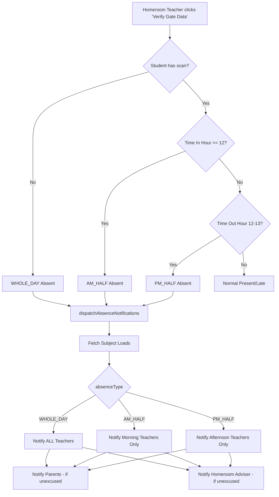

# Attendance Notification Engine Implementation Plan

## Executive Summary

This plan implements a **Time-Bound Fractional Attendance** system with **Targeted Notification Routing** for the Educare Track system. The engine will calculate time-based attendance (Whole Day, AM Half-Day, PM Half-Day) and notify only the affected teachers.

---

## Current State Analysis

### Existing Components:
1. **[`core/general-core.js`](core/general-core.js)** - Has `checkSession`, `showNotification`, `createEarlyExitNotification`, and date utility functions
2. **[`core/attendance-utils.js`](core/attendance-utils.js)** - Has suspension checking and attendance allowed functions
3. **[`teacher/teacher-core.js`](teacher/teacher-core.js:2942)** - Has `notifySubjectTeachersOfExcuse` function that notifies ALL subject teachers (not time-bound)
4. **[`teacher/teacher-homeroom.js`](teacher/teacher-homeroom.js:678)** - Has `verifyGateData` function that marks attendance but doesn't detect half-days

### Database Tables Used:
- `students` - Student info with parent_id and class_id
- `classes` - Class info with adviser_id
- `subject_loads` - Teacher-subject-class mapping with schedule_days and schedule_time_start
- `attendance_logs` - Daily attendance records
- `notifications` - Notification dispatch table
- `excuse_letters` - Excuse letter records

---

## Implementation Plan

### Phase 1: Create Notification Engine
**File:** `core/notification-engine.js`

Create a new file with the `dispatchAbsenceNotifications` function that:

1. **Fetches student data** - Gets student, parent, and class info
2. **Fetches subject loads** - Gets teacher's schedule for the day
3. **Time-bound routing logic:**
   - `WHOLE_DAY` → Notify ALL subject teachers
   - `AM_HALF` → Notify ONLY morning teachers (class starts before 12:00 PM)
   - `PM_HALF` → Notify ONLY afternoon teachers (class starts at or after 12:00 PM)
4. **Creates notifications** for:
   - Affected subject teachers
   - Parents (only for unexcused)
   - Homeroom adviser (only for unexcused)

```javascript
// Key Parameters
// studentId - ID of the absent student
// date - YYYY-MM-DD format
// absenceType - 'WHOLE_DAY' | 'AM_HALF' | 'PM_HALF'
// isExcused - boolean for excused absence
```

---

### Phase 2: Update Homeroom Verification
**File:** [`teacher/teacher-homeroom.js`](teacher/teacher-homeroom.js:678)

Update the `verifyGateData()` function to:

1. **Detect AM Half-Day:**
   - Student has a scan with status "Late"
   - Time in is AFTER 12:00 PM (hour >= 12)
   - Mark as "Half-Day Morning Absent"

2. **Detect PM Half-Day:**
   - Student has both time_in and time_out
   - Time out is between 12:00 PM - 1:00 PM (hour 12-13)
   - No subsequent time_in after the time_out
   - Mark as "Half-Day Afternoon Absent"

3. **Call dispatchAbsenceNotifications** with appropriate absence type

---

### Phase 3: Update Excuse Letter Approval
**File:** [`teacher/teacher-core.js`](teacher/teacher-core.js:1442)

Update `approveExcuseLetter()` to:

1. Replace the call to `notifySubjectTeachersOfExcuse` with `dispatchAbsenceNotifications`
2. Pass `isExcused = true` to the engine
3. Use absence scope from modal or default to WHOLE_DAY

---

### Phase 4: Maintain Backward Compatibility
**File:** [`teacher/teacher-core.js`](teacher/teacher-core.js:2942)

Update `notifySubjectTeachersOfExcuse()` to:

1. Either redirect to `dispatchAbsenceNotifications` OR
2. Keep as-is for backward compatibility with other modules

---

## Mermaid Diagram: Notification Flow



---

## Risk Mitigation

1. **Backward Compatibility:** Keep existing notification functions as wrappers to prevent breaking other modules
2. **Graceful Degradation:** If notification engine fails, log error but continue attendance verification
3. **Testing:** Test with various time scenarios (before 12 PM, exactly 12 PM, after 12 PM, 12-1 PM)

---

## Files to Modify

| File | Change Type | Lines |
|------|-------------|-------|
| `core/notification-engine.js` | **NEW** | - |
| `teacher/teacher-homeroom.js` | Modify | 678-708 |
| `teacher/teacher-core.js` | Modify | 1442-1515, 2942-2970 |

---

## Acceptance Criteria

1. ✅ Whole day absent → All teachers notified
2. ✅ AM Half-Day (arrived after 12 PM) → Only morning teachers notified
3. ✅ PM Half-Day (left 12-1 PM, no return) → Only afternoon teachers notified
4. ✅ Excused absence → Parents NOT notified (handled by excuse letter)
5. ✅ Existing functionality remains intact
6. ✅ No breaking changes to other modules
