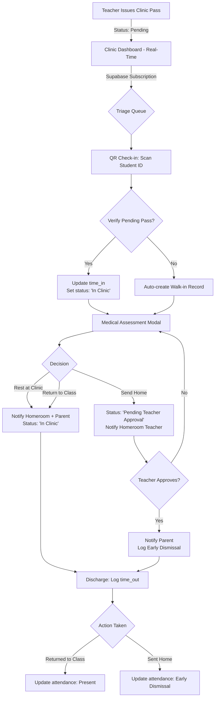

# Clinic Module Enhancement Plan
## Bringing Clinic Module to 98% Enterprise Standard

### Executive Summary
This plan outlines the comprehensive enhancement of the Clinic Module to match the enterprise standards already established in the Admin and Teacher modules. The focus is on real-time functionality, enterprise-grade UI, and seamless integration with the existing notification and attendance engines.

---

## ✅ ALL PHASES COMPLETED

### Implementation Summary

#### Phase 1: Real-Time Dashboard (clinic-dashboard.html)
- **4-Column Stats Grid**: Pending Passes, Currently in Clinic, Sent Home Today, Today's Check-ins
- **Live Indicators**: Pulsing dots showing real-time status
- **Supabase Subscription**: `supabase.channel('clinic-dashboard-realtime')` listening to `clinic_visits` table
- **Auto-refresh**: Dashboard updates automatically when any clinic visit changes

#### Phase 2: QR Check-in & Triage Engine (clinic-scanner.js)
- **QR Validation**: Reuses `SCAN_REGEX` from teacher-gatekeeper-mode.js
- **Check-in Workflow**: Pending → Auto-approve, Approved → Check-in, No pass → Auto-create walk-in
- **Button Locking**: Prevents double-entries with `btn.disabled = true` and loading spinner
- **Manual Search**: Added manual student search with same workflow

#### Phase 3: Medical Assessment UI (clinic-dashboard.html)
- **Enterprise Modal**: White rounded-3xl with gradient header
- **Reason Dropdown**: Headache, Fever, Injury, Stomach Ache, Nausea, etc.
- **Clinical Notes**: Textarea for observations
- **Vital Signs**: Temperature, Blood Pressure, Pulse inputs
- **Decision Radio Buttons**: Rest at Clinic, Return to Class, Send Home
- **Assess Button**: Added to active patients table

#### Phase 4: 360-Degree Notification Loop
- **Rest/Return Decisions**: Notify Homeroom Adviser + Parent immediately
- **Send Home Decision**: Status = 'Awaiting Teacher Approval', notify Homeroom Teacher (URGENT)
- **Notification Types**: Uses `notifications` table with proper type routing

#### Phase 5: Discharge & Attendance Sync
- **Discharge Workflow**: Log time_out when discharging
- **Early Dismissal Logging**: When "Sent Home", log to `attendance_logs` table
- **Status Update**: Marks as "Early Dismissal" in attendance

#### DRY Principles Applied
- Used `general-core.js`: `showNotification()`, `getLocalISOString()`, `showToast()`
- Optional chaining: `student?.classes?.grade_level || 'Unknown'`
- Reused SCAN_REGEX from teacher-gatekeeper-mode.js
- Button locking pattern used consistently

---

## Files Modified

| File | Changes |
|------|---------|
| `clinic/clinic-dashboard.html` | Real-time subscription, 4-column stats, Medical Assessment Modal, Discharge + Attendance Sync |
| `clinic/clinic-scanner.js` | QR validation, walk-in creation, button locking, manual search |
| `plans/clinic-module-enhancement-plan.md` | This plan document |

---

## Workflow Summary

```
Teacher Issues Pass → Nurse Dashboard (Real-Time) → QR Check-in
    → Medical Assessment → Decision:
        - Rest/Return → Notify Teacher + Parent → Discharge
        - Send Home → Notify Teacher (URGENT) → Teacher Approves → Notify Parent → Log Early Dismissal → Discharge
```

---

## Current State Analysis

### Files to Modify
| File | Current State | Required Changes |
|------|---------------|------------------|
| `clinic/clinic-dashboard.html` | Basic stats cards, static content | Add live stats, real-time subscription support |
| `clinic/clinic-core.js` | Basic visit management | Add QR check-in, triage engine, medical assessment |
| `clinic/clinic-scanner.js` | Basic QR scanner | Enhance with full check-in workflow |

### Existing Patterns to Reuse
- **general-core.js**: `showNotification()`, `showModal()`, `showConfirm()`, `formatDate()`, `formatTime()`, `getSettings()`
- **notification-engine.js**: Targeted notification routing to teachers/parents
- **teacher-gatekeeper-mode.js**: QR scanning with jsQR, SCAN_REGEX validation

---

## Workflow Diagram



---

## Detailed Implementation Phases

### PHASE 1: Real-Time Dashboard (clinic-dashboard.html + .js)

#### 1.1 Supabase Real-Time Subscription
- **Channel**: `supabase.channel('clinic-realtime')`
- **Table**: `clinic_visits`
- **Events**: INSERT, UPDATE
- **Filter**: Today's date (`time_in` >= start of day)

#### 1.2 Live Stats Cards
| Stat | Source Query | Update Trigger |
|------|--------------|----------------|
| Pending Passes | `status = 'Pending'` | INSERT on clinic_visits |
| Currently In Clinic | `status = 'In Clinic'` | UPDATE to 'In Clinic' |
| Sent Home Today | `action_taken = 'Sent Home'` AND today's date | UPDATE to discharged |

#### 1.3 UI Standards
- Use existing red theme with white rounded-3xl cards
- Lucide icons: `clock`, `heart-pulse`, `user-check`, `user-x`
- Main content padding: `<main class="flex-1 overflow-auto p-8">`

---

### PHASE 2: QR Check-in & Triage Engine (clinic-core.js)

#### 2.1 QR Validation
- Reuse `SCAN_REGEX = /^EDU-\d{4}-[GK]\d{3}-[A-Z0-9]{4}$/`
- Validate against `student_id_text` field

#### 2.2 Check-in Workflow
```
1. Scan QR Code
2. Validate format → lookup student
3. Check for pending pass (status = 'Approved')
4a. If pending pass exists:
    - Update: time_in = NOW(), status = 'In Clinic'
    - Show success notification
4b. If no pending pass:
    - Create new clinic_visits record:
      - student_id, status = 'In Clinic', time_in = NOW()
      - reason = 'Walk-in'
    - Show walk-in notification
5. Lock button during DB write
```

#### 2.3 Button Locking Pattern
```javascript
// Disable button, show spinner
btn.disabled = true;
btn.innerHTML = '<i class="animate-spin">⏳</i> Processing...';

// ... perform DB operation ...

// Re-enable on success/error
btn.disabled = false;
btn.innerHTML = 'Original Text';
```

---

### PHASE 3: Medical Assessment UI

#### 3.1 Modal Structure
- **Trigger**: Click "Assess Patient" on active patient row
- **Fields**:
  - Reason (Dropdown): Headache, Fever, Injury, Stomach Ache, General Malaise, Other
  - Clinical Notes (Textarea): Detailed observations
  - Vital Signs (Optional): Temperature, Blood Pressure, Pulse
  - Decision (Radio): Rest at Clinic, Return to Class, Send Home

#### 3.2 Status Logic
| Decision | New Status | Next Action |
|----------|------------|--------------|
| Rest at Clinic | 'In Clinic' | Notify Homeroom + Parent |
| Return to Class | 'Discharged' | Notify Homeroom + Parent |
| Send Home | 'Pending Teacher Approval' | Notify Homeroom Teacher |

---

### PHASE 4: 360-Degree Notification Loop

#### 4.1 Notification Types
- **Clinic Pass Issued**: Teacher → Clinic Staff (existing)
- **Assessment Complete - Rest/Return**: Clinic → Homeroom + Parent
- **Assessment Complete - Send Home**: Clinic → Homeroom Teacher (URGENT)
- **Teacher Approval Given**: Teacher → Clinic + Parent
- **Discharge**: Clinic → Homeroom

#### 4.2 Implementation
```javascript
async function dispatchClinicNotifications(visit, decision) {
    const studentName = visit.students?.full_name || 'Student';
    const classInfo = `${visit.students?.classes?.grade_level || ''}-${visit.students?.classes?.section_name || ''}`;
    
    if (decision === 'Send Home') {
        // URGENT: Notify Homeroom Teacher for approval
        await supabase.from('notifications').insert({
            recipient_id: visit.students?.classes?.adviser_id,
            recipient_role: 'teachers',
            title: 'Clinic: Send Home Approval Required',
            message: `${studentName} needs to go home. Please approve.`,
            type: 'clinic_approval',
            is_urgent: true
        });
    } else {
        // Informational: Notify Homeroom + Parent
        const notifications = [
            {
                recipient_id: visit.students?.classes?.adviser_id,
                recipient_role: 'teachers',
                title: `Clinic Update - ${classInfo}`,
                message: `${studentName} has been ${decision === 'Rest at Clinic' ? 'admitted for rest' : 'cleared to return to class'}.`,
                type: 'clinic_update'
            },
            {
                recipient_id: visit.students?.parent_id,
                recipient_role: 'parents',
                title: 'Clinic Visit Update',
                message: `${studentName} visited the clinic and was ${decision === 'Rest at Clinic' ? 'advised to rest at the clinic' : 'cleared to return to class'}.`,
                type: 'clinic_visit'
            }
        ];
        await supabase.from('notifications').insert(notifications);
    }
}
```

---

### PHASE 5: Discharge & Attendance Sync

#### 5.1 Discharge Actions
| Action | Status | Attendance Impact |
|--------|--------|-------------------|
| Returned to Class | 'Discharged' | None (already present) |
| Sent Home | 'Discharged' | Log early dismissal |
| Resting in Clinic | 'In Clinic' | None |

#### 5.2 Early Dismissal Integration
When "Sent Home" is approved and discharged:
```javascript
async function logEarlyDismissal(visit) {
    const today = getLocalISOString();
    const now = new Date().toISOString();
    
    // Check if attendance record exists for today
    const { data: existing } = await supabase
        .from('attendance_logs')
        .select('id')
        .eq('student_id', visit.student_id)
        .eq('log_date', today)
        .single();
    
    if (existing) {
        // Update existing record: log early exit
        await supabase
            .from('attendance_logs')
            .update({ 
                time_out: now,
                status: 'Early Dismissal',
                remarks: `Clinic discharge - Sent Home`
            })
            .eq('id', existing.id);
    } else {
        // Create new record (unlikely scenario)
        await supabase
            .from('attendance_logs')
            .insert({
                student_id: visit.student_id,
                log_date: today,
                time_in: visit.time_in, // preserve original time in
                time_out: now,
                status: 'Early Dismissal',
                remarks: 'Clinic discharge - Sent Home'
            });
    }
}
```

---

## DRY Principles & Anti-Redundancy

### Reuse from general-core.js
| Function | Usage |
|----------|-------|
| `showNotification()` | All user feedback |
| `showModal()` | Medical Assessment Modal |
| `showConfirm()` | Discharge confirmation |
| `formatDate()` | Date display in tables |
| `formatTime()` | Time display |
| `getSettings()` | Cache settings |
| `getLocalISOString()` | Today's date for queries |

### Null Safety (Optional Chaining)
All student data access must use:
```javascript
student?.classes?.grade_level || 'Unknown'
student?.classes?.adviser_id || null
visit?.students?.full_name || 'Unknown Student'
```

---

## Implementation Order (Per User Request)

The user has requested phased delivery. The plan will be executed in this sequence:

1. **Phase 1 & 2 First** (This message):
   - Real-Time Dashboard with Supabase subscriptions
   - QR Check-in & Triage Engine
   
2. **Phase 3-5 Later** (After confirmation):
   - Medical Assessment Modal
   - Notification Loop
   - Discharge & Attendance Sync

---

## Success Criteria

- ✅ Dashboard updates in real-time without page refresh
- ✅ QR check-in processes in < 2 seconds
- ✅ No double-entries via button locking
- ✅ Notifications delivered to correct stakeholders
- ✅ Early dismissal logged in attendance
- ✅ All UI matches enterprise standard (Lucide, rounded-3xl, Tailwind)
