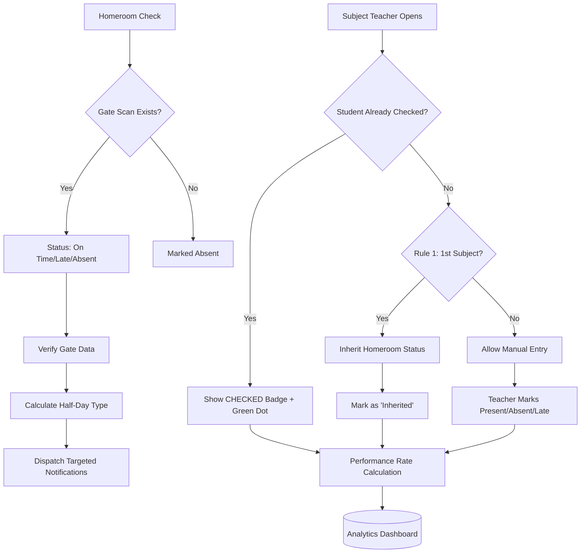

# Cup Theory & Analytics Upgrade Plan

## Executive Summary

This plan outlines the implementation of the **Cup Theory Attendance Pipeline** and **Advanced Analytics** for the Educare Track Teacher Module. The Cup Theory reimagines how attendance flows from Homeroom → Subject Teachers → Analytics.

---

## Business Logic: The Cup Theory

### The Analogy:
Think of attendance as water flowing through cups:
- **Cup 1 (Homeroom):** Raw, verified daily foundation
- **Cup 2 (1st Subject):** Automatically inherits Homeroom status (Spillover)
- **Cups 3-8 (Other Subjects):** Independent verification

### Key Rules:
1. **Rule 1 (1st Subject Spillover):** The first subject of the day inherits Homeroom attendance status automatically
2. **Rule 2 (Time Independence):** Teachers can check attendance anytime. UI must flag students already checked to prevent double-entry
3. **Performance Rate Math:** `(Homeroom + Subjects Present) / Total Cups`
4. **Excused Handling:** Excused absences must appear in all analytics charts

---

## Implementation Plan

### Phase 1: Fractional Notification Engine (Already Implemented ✅)
- [x] Created `core/notification-engine.js`
- [x] Time-bound routing (AM Half, PM Half, Whole Day)
- [x] Targeted teacher notifications
- [x] Excused vs Unexcused handling

### Phase 2: Cup Theory - Subject Attendance UI
**File:** `teacher/teacher-subject-attendance.js`

#### Code Snippet 1: "Already Checked" Indicator
**Why:** Rule 2 requires teachers to know if a student was already marked for that subject today to prevent double-entry confusion.

```javascript
// In renderStudentList function - add these checks:
// Check if student already has subject-specific attendance
const subjectCheckedStatus = remarksObj[subjectName]; 
const isAlreadyChecked = !!subjectCheckedStatus;

// Add visual indicators in the HTML return:
// - Green dot: isAlreadyChecked
// - "CHECKED" badge: isAlreadyChecked
```

**Why:** The green dot and badge give immediate visual feedback that prevents teachers from accidentally changing attendance that was already marked.

#### Code Snippet 2: Rule 1 - 1st Subject Spillover (CRITICAL FIX)
**Why:** Only the FIRST subject of the day (by schedule_time_start) should inherit Homeroom status. This prevents all subjects from auto-inheriting.

```javascript
// Fetch and sort subject loads by time
const { data: subjectLoads } = await supabase
    .from('subject_loads')
    .select('id, subject_name, schedule_time_start')
    .eq('class_id', classId)
    .eq('teacher_id', currentUser.id);

// Sort by schedule_time_start to find 1st subject
subjectLoads.sort((a, b) => a.schedule_time_start.localeCompare(b.schedule_time_start));
const firstSubjectId = subjectLoads[0]?.id;

// Check if current subject is the first one
const isFirstSubject = currentSubjectLoadId === firstSubjectId;

// Rule 1: Only apply Homeroom status if this IS the 1st subject AND no subject-specific status exists
const displayStatus = subjectCheckedStatus 
    ? subjectCheckedStatus 
    : (isFirstSubject ? hmStatus : '');  // Leave blank if not 1st subject
```

**Why:** Without this check, every unchecked subject would inherit Homeroom status, breaking the Cup Theory. We must verify this is chronologically the first subject.

#### Code Snippet 3: Inherited Status Badge
**Why:** Teachers need to know when a status was inherited vs manually entered.

```javascript
// Add in HTML return:
${isFirstSubject && !subjectCheckedStatus ? 
    `<span class="bg-blue-50 text-blue-600 text-[9px] px-1.5 py-0.5 rounded font-bold uppercase border border-blue-200">Inherited</span>` 
    : ''}
```

---

### Phase 3: Analytics - Excused Integration
**File:** `teacher/teacher-data-analytics.js`

#### Code Snippet 4: Add Excused to Trend Chart
**Why:** Excused absences must be tracked separately from unexcused absences in analytics.

```javascript
// In updateTrendChart function - update the datasets array:
datasets: [
    {
        label: 'Present/On-Time',
        data: Object.values(trendData).map(d => d.present),
        borderColor: '#10b981', 
        backgroundColor: '#10b981', 
        tension: 0.4, 
        borderWidth: 3
    },
    {
        label: 'Late',
        data: Object.values(trendData).map(d => d.late),
        borderColor: '#f59e0b', 
        backgroundColor: '#f59e0b', 
        tension: 0.4, 
        borderWidth: 3
    },
    {
        label: 'Absent',
        data: Object.values(trendData).map(d => d.absent),
        borderColor: '#ef4444', 
        backgroundColor: '#ef4444', 
        tension: 0.4, 
        borderWidth: 3
    },
    {
        label: 'Excused',
        data: Object.values(trendData).map(d => d.excused || 0), // Added Excused line
        borderColor: '#3b82f6', 
        backgroundColor: '#3b82f6', 
        tension: 0.4, 
        borderWidth: 3, 
        borderDash: [5, 5]  // Dotted line for distinction
    }
]
```

**Why:** Blue dotted line visually distinguishes excused (often medical) absences from unexcused truancy.

#### Code Snippet 5: Count Excused in Trend Data
**Why:** The chart needs data to display.

```javascript
// In the trendData accumulator:
if (log.status === 'Excused') {
    data[date].excused = (data[date].excused || 0) + 1;
}
```

---

### Phase 4: Performance Rate Dashboard
**File:** `teacher/teacher-dashboard.html` (inside existing script block)

#### Code Snippet 6: Parse JSONB Remarks
**Why:** The attendance is stored as JSONB in the remarks column. We need to parse it to calculate performance rate.

```javascript
// Helper function to calculate Performance Rate
async function calculatePerformanceRate(studentId, dateStr) {
    const { data: log } = await supabase
        .from('attendance_logs')
        .select('status, remarks')
        .eq('student_id', studentId)
        .eq('log_date', dateStr)
        .single();
    
    if (!log) return 0;
    
    // Parse JSONB remarks column
    const remarksObj = typeof log.remarks === 'string' 
        ? JSON.parse(log.remarks) 
        : (log.remarks || {});
    
    // Total Cups = 1 (Homeroom) + number of subjects checked
    const subjectsChecked = Object.keys(remarksObj).length;
    const totalCups = 1 + subjectsChecked;
    
    // Count Present/Late in subjects
    let subjectPresents = 0;
    Object.values(remarksObj).forEach(status => {
        if (['Present', 'On Time'].includes(status)) subjectPresents++;
    });
    
    // Homeroom status (1 if present, 0 if absent)
    const hmPresent = ['Present', 'On Time', 'Late'].includes(log.status) ? 1 : 0;
    
    // Performance Rate = (Homeroom + Subject Present) / Total Cups
    const rate = totalCups > 0 
        ? ((hmPresent + subjectPresents) / totalCups) * 100 
        : 0;
    
    return Math.round(rate);
}
```

**Why:** This implements the Cup Theory math: (Homeroom + Subjects Present) / Total Cups. The JSONB parsing is critical because Supabase stores the remarks as JSON.

#### Code Snippet 7: Performance Cards UI
**Why:** Display the calculated rates on the dashboard.

```javascript
// Add to dashboard HTML:
<div class="grid grid-cols-3 gap-4 mb-6">
    <div class="bg-white p-4 rounded-xl border">
        <p class="text-xs text-gray-500 uppercase">Homeroom Rate</p>
        <p class="text-2xl font-black text-emerald-600">92%</p>
    </div>
    <div class="bg-white p-4 rounded-xl border">
        <p class="text-xs text-gray-500 uppercase">Subject Rate</p>
        <p class="text-2xl font-black text-blue-600">88%</p>
    </div>
    <div class="bg-white p-4 rounded-xl border">
        <p class="text-xs text-gray-500 uppercase">Performance Rate</p>
        <p class="text-2xl font-black text-purple-600">90%</p>
    </div>
</div>
```

---

## Mermaid Diagram: Cup Theory Flow



---

## Files to Modify

| File | Change Type | Description |
|------|-------------|-------------|
| `teacher/teacher-subject-attendance.js` | Modify | Add "Already Checked" UI + Rule 1 logic |
| `teacher/teacher-data-analytics.js` | Modify | Add Excused to trend charts |
| `teacher/teacher-dashboard.html` | Modify | Add Performance Rate cards (inside existing script block) |

---

## Acceptance Criteria

1. ✅ Rule 1 ONLY applies to 1st subject (chronologically by schedule_time_start)
2. ✅ Subject teachers see "Checked" badge for students already marked today
3. ✅ Green dot appears on avatars of checked students
4. ✅ First subject inherits Homeroom status only if chronologically first
5. ✅ Trend charts show Excused absences as blue dotted line
6. ✅ Performance Rate displays on dashboard
7. ✅ JSONB parsing handles attendance_logs.remarks correctly
8. ✅ No breaking changes to existing functionality

---

## Risk Mitigation

1. **Backward Compatibility:** Only modify UI rendering, keep data structure intact
2. **Performance:** Cache Homeroom status per session to reduce DB calls
3. **Graceful Fallback:** If subject has no schedule, skip Rule 1
