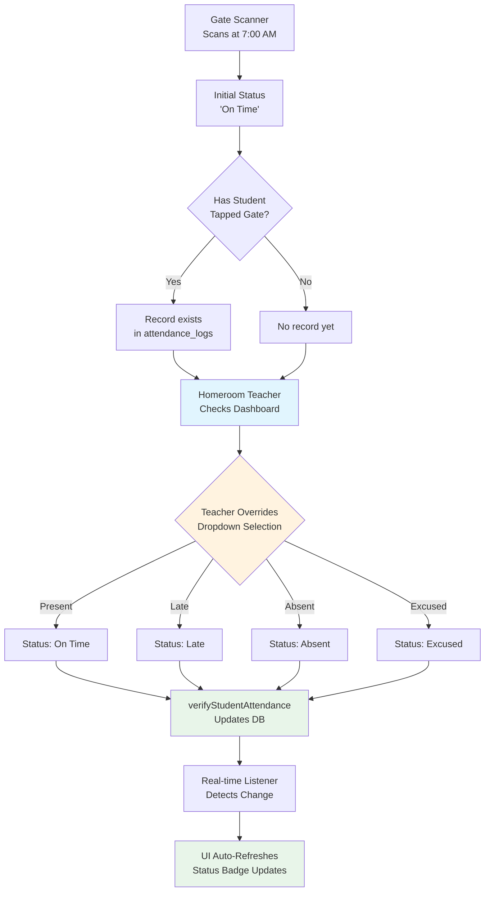

# Homeroom Verification Implementation Plan

## Overview
This plan implements the "Homeroom Verification" logic where the Gate Scanner provides initial status, but the Homeroom Adviser can manually override it as the ultimate source of truth.

## Context Gathered
- **HTML file**: `teacher/teacher-homeroom.html` (lines 154-165 contain table headers)
- **JS file**: `teacher/teacher-homeroom.js`
  - `preFetchTodayData()` at line 201-222 - currently selects without `id`
  - `renderStudents()` at line 281-342 - table row template
- **Database**: `attendance_logs` table has `id` column (confirmed in schema)

---

## Implementation Steps

### PART 1: HTML UI UPDATE (`teacher-homeroom.html`)
**Location**: Lines 154-165 (thead block)

**Change**: Replace `<thead>` to add "Verify" column and remove LRN column
- Current columns: Student ID, Name, LRN, Time In, Status, Actions
- New columns: Student ID, Name, Time In, Gate Status, **Manual Verify**, Actions

---

### PART 2: FETCHING RECORD ID (`teacher-homeroom.js`)
**Location**: Line 210 in `preFetchTodayData()` function

**Change**: Add `id` to the select string
```javascript
// BEFORE:
.select('student_id, status, time_in, source')

// AFTER:
.select('id, student_id, status, time_in, source')
```

---

### PART 3: ADDING DROPDOWN UI (`teacher-homeroom.js`)
**Location**: Lines 305-338 in `renderStudents()` function

**Change**: 
- Remove LRN column (line 318-320)
- Add "Manual Verify" dropdown column with options: On Time, Late, Absent, Excused
- Update Time In to show formatted time instead of raw timestamp

---

### PART 4: MANUAL OVERRIDE LOGIC (`teacher-homeroom.js`)
**Location**: End of file (after line 482)

**Change**: Add new function `verifyStudentAttendance(studentId, newStatus)`
- If record exists → UPDATE the existing record
- If no record → CREATE new record
- Uses real-time subscription for auto-refresh

---

## Mermaid Diagram: Homeroom Verification Flow



---

## Files to Modify

| File | Changes |
|------|---------|
| `teacher/teacher-homeroom.html` | Add "Verify" column header, remove LRN header |
| `teacher/teacher-homeroom.js` | Add `id` to select, update renderStudents template, add verifyStudentAttendance function |

---

## Ready for Implementation?
This plan is ready for execution in Code mode. The changes are minimal and surgical - just 4 specific code replacements/additions as detailed above.
