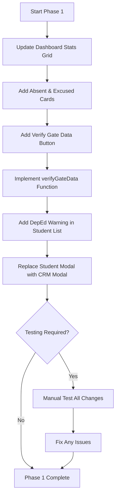

# Phase 1 Implementation Plan: Teacher Module Enterprise Overhaul

## Overview
This document outlines the implementation plan for Phase 1 of the Teacher Module overhaul, focusing on:
1. **Dashboard Analytics Overhaul** - Adding Absent and Excused metrics to the summary board
2. **Homeroom Verification UX** - Adding "Verify Gate Data" button
3. **DepEd Critical Absence Warning** - Visual flagging for 10+ absences
4. **Enterprise Student Modal** - Tabbed CRM-style modal with DepEd warnings

---

## Current State Analysis

### Files to Modify:
- `teacher/teacher-dashboard.html` - Lines ~111-140 (stats grid)
- `teacher/teacher-homeroom.html` - Lines ~183-250 (modal), ~170 (buttons)
- `teacher/teacher-homeroom.js` - Lines ~280 (renderStudents), ~180 (function calls)

### Current Implementation:
| Component | Current State |
|-----------|---------------|
| Dashboard Stats | 4 cards (Present, Late, Clinic) - needs Absent & Excused |
| Homeroom Header | Has "All Present" button - needs "Verify Gate Data" |
| Student Row | No absence warning - needs 10+ flag |
| Student Modal | Basic info display - needs tabs + DepEd warning |

---

## Implementation Steps

### Step 1: Dashboard Analytics Overhaul
**File:** `teacher/teacher-dashboard.html`
- [ ] Locate `<div id="adviser-stats">` (currently grid-cols-4)
- [ ] Update to `grid-cols-2 lg:grid-cols-5`
- [ ] Add Absent card (red theme)
- [ ] Add Excused card (blue theme)
- [ ] Update JS to populate new stat elements

### Step 2: Homeroom Verification UX
**Files:** `teacher/teacher-homeroom.html`, `teacher/teacher-homeroom.js`
- [ ] Add "Verify Gate Data" button in header section
- [ ] Implement `verifyGateData()` function
- [ ] Connect button to function

### Step 3: DepEd Absence Warning
**File:** `teacher/teacher-homeroom.js`
- [ ] Modify `renderStudents()` function
- [ ] Add warning icon for students with 10+ absences
- [ ] Use pulsing red badge

### Step 4: Enterprise Student Modal
**File:** `teacher/teacher-homeroom.html`
- [ ] Replace existing simple modal with tabbed CRM modal
- [ ] Add Overview, Attendance History, Clinic Logs, Excuse Letters tabs
- [ ] Add DepEd Critical Absence Warning banner
- [ ] Add gate scan history section

---

## Mermaid Diagram: Implementation Flow



---

## Code Snippets Summary

### 1. Dashboard Stats HTML (teacher-dashboard.html)
```html
<div id="adviser-stats" class="grid grid-cols-2 lg:grid-cols-5 gap-4 mb-8">
    <!-- Present, Late, Absent, Excused, Clinic cards -->
</div>
```

### 2. Verify Button (teacher-homeroom.html)
```html
<button onclick="verifyGateData()" class="...">
    <i data-lucide="shield-check"></i> Verify Gate Data
</button>
```

### 3. DepEd Warning (teacher-homeroom.js)
```javascript
${student.total_absences >= 10 ? `<span class="animate-pulse">⚠</span>` : ''}
```

### 4. Enterprise Modal (teacher-homeroom.html)
- Full tabbed interface with 4 tabs
- DepEd warning banner
- Attendance metrics grid
- Gate scan history

---

## Next Steps
1. Execute each implementation step in order
2. Test each component individually
3. Verify no breaking changes to existing functionality
4. Prepare for Phase 2 (Clinic Search, Subject Teacher privacy, Excuse Letter loop)
