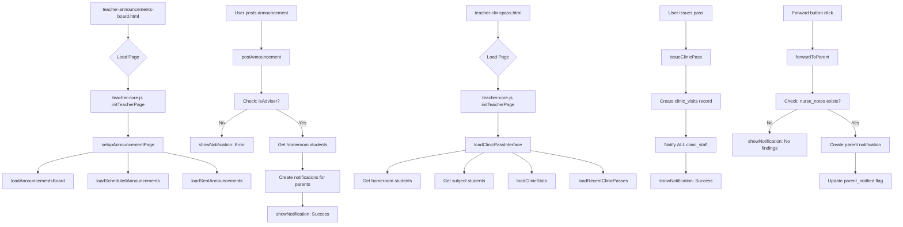

# Teacher Module Debugging Plan: Announcements & Clinic Pass

## Executive Summary
Refactor teacher-announcements-board.html and teacher-clinicpass.html to properly utilize teacher-core.js for all core functionality, add missing features, and ensure consistency with the rest of the teacher module.

---

## Current Analysis

### 1. teacher-announcements-board.html & teacher-announcements-board.js

**Current Problems:**
- Standalone JS uses `announcements` table with `posted_by_admin_id` - wrong approach
- Should use `notifications` table for teacher-to-parent announcements (as implemented in core)
- No adviser check (only advisers can post class announcements)
- Missing features from core: scheduling, urgent flag, character counter
- Missing containers for scheduled/sent announcements
- Uses `alert()` instead of `showNotification()`
- "Recent Announcements" section shows wrong data (admin-to-teacher instead of teacher-to-parent)

**What's in teacher-core.js (already implemented):**
- `setupAnnouncementPage()` - initializes the page (lines 1212-1228)
- `postAnnouncement()` - posts to parents via notifications table with scheduling & urgent support (lines 1099-1209)
- `loadScheduledAnnouncements()` - loads scheduled announcements (lines 1336+)
- `loadSentAnnouncements()` - loads sent announcements (lines 1231-1276)
- `showNotification()` and `showConfirmationModal()` - unified feedback modals

**Required HTML Elements:**
| Element ID | Purpose |
|------------|---------|
| `#announcement-title` | Title input (exists) |
| `#announcement-content` | Content textarea (exists) |
| `#announcement-date` | Schedule date input (MISSING) |
| `#announcement-time` | Schedule time input (MISSING) |
| `#announcement-urgent` | Urgent checkbox (MISSING) |
| `#char-counter` | Character counter display (MISSING) |
| `#scheduled-announcements-list` | Container for scheduled (MISSING) |
| `#sent-announcements-list` | Container for sent (MISSING) |

---

### 2. teacher-clinicpass.html & teacher-clinicpass.js

**Current Problems:**
- Standalone JS redefines core functions causing duplication
- Uses `alert()` instead of `showNotification()`
- Clinic staff notification uses `recipient_role: 'clinic_staff'` without `recipient_id` - likely incorrect
- Three statistics cards exist but are never updated
- Standalone adds useful feature: subject teacher support for issuing passes

**What's in teacher-core.js:**
- `loadClinicPassInterface()` - loads students (but only homeroom) (lines 607-643)
- `issueClinicPass()` - creates visit (but no staff notification) (lines 646-678)
- `loadRecentClinicPasses()` - lists passes (but missing forward logic) (lines 681-734)
- `forwardToParent()` - forwards findings (lines 737-778)

**Missing Features to Add to Core:**
1. Subject teacher support - load students from subject loads
2. Clinic staff notification - fetch all clinic staff and insert individual notifications
3. Clinic statistics - count today/active/completed passes
4. Forward button logic - only show when nurse_notes exist and parent_notified is false

---

## Implementation Plan

### Step 1: Update teacher-announcements-board.html
- Add date input, time input, urgent checkbox
- Add character counter display
- Add containers for scheduled and sent announcements
- Remove standalone JS script tag (teacher-announcements-board.js)

### Step 2: Remove teacher-announcements-board.js
- Delete the file as core handles everything

### Step 3: Enhance teacher-core.js Announcements
- Add adviser check in `postAnnouncement()` (already has at line 1156)
- Ensure all features work: scheduling, urgent flag, character counter

### Step 4: Update teacher-clinicpass.html
- Keep existing structure
- Ensure stat cards have correct IDs (`#today-passes`, `#active-passes`, `#completed-passes`)
- Remove standalone JS script tag (teacher-clinicpass.js)

### Step 5: Enhance teacher-core.js Clinic Pass Functions
- Add `loadSubjectStudentsForClinicPass()` - load students from teacher's subject loads
- Modify `loadClinicPassInterface()` - include subject students
- Modify `issueClinicPass()` - add proper clinic staff notifications
- Add `loadClinicStats()` - update stat cards
- Modify `loadRecentClinicPasses()` - add forward button with proper logic

### Step 6: Remove teacher-clinicpass.js
- Delete the file as all functionality is now in core

---

## Mermaid Diagram: Current vs Future Flow

---

## Files to Modify
1. `teacher/teacher-announcements-board.html` - Add missing HTML elements
2. `teacher/teacher-announcements-board.js` - DELETE
3. `teacher/teacher-clinicpass.html` - Remove standalone JS reference
4. `teacher/teacher-clinicpass.js` - DELETE (functionality moved to core)
5. `teacher/teacher-core.js` - Add/enhance clinic pass functions

---

## Testing Checklist
- [ ] Announcements page loads without errors
- [ ] Can post announcement (as adviser only)
- [ ] Character counter works
- [ ] Scheduling works
- [ ] Urgent flag works
- [ ] Scheduled announcements display
- [ ] Sent announcements display
- [ ] Clinic pass page loads without errors
- [ ] Can issue pass (homeroom student)
- [ ] Can issue pass (subject student - for subject teachers)
- [ ] Statistics update correctly
- [ ] Forward to parent works (when nurse notes exist)
- [ ] Notifications use showNotification (not alert)
